 11 - Laporan UAS

## Hasil Tampilan UAS 1

### Hasil Tampilan Halaman Login
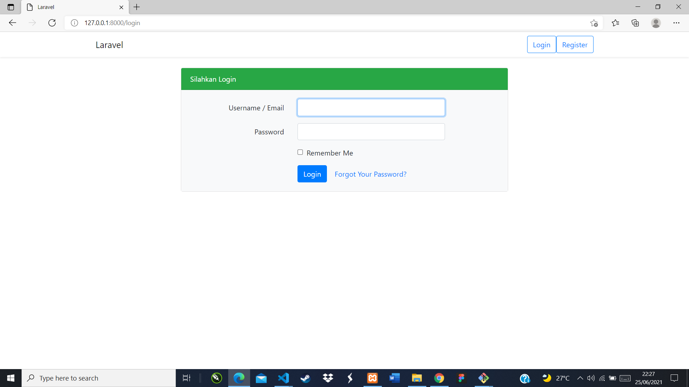

### Hasil Tampilan Halaman Register
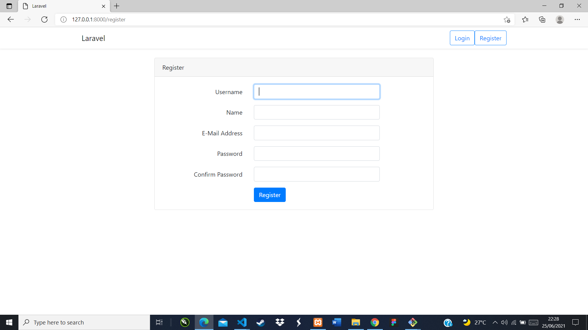

### Hasil Tampilan Halaman Home
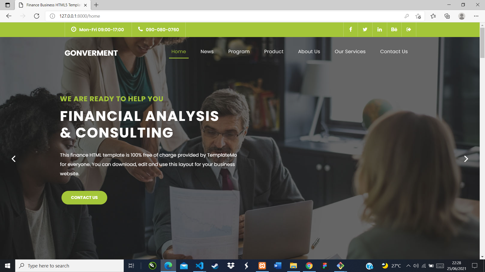

### Hasil Tampilan Halaman News
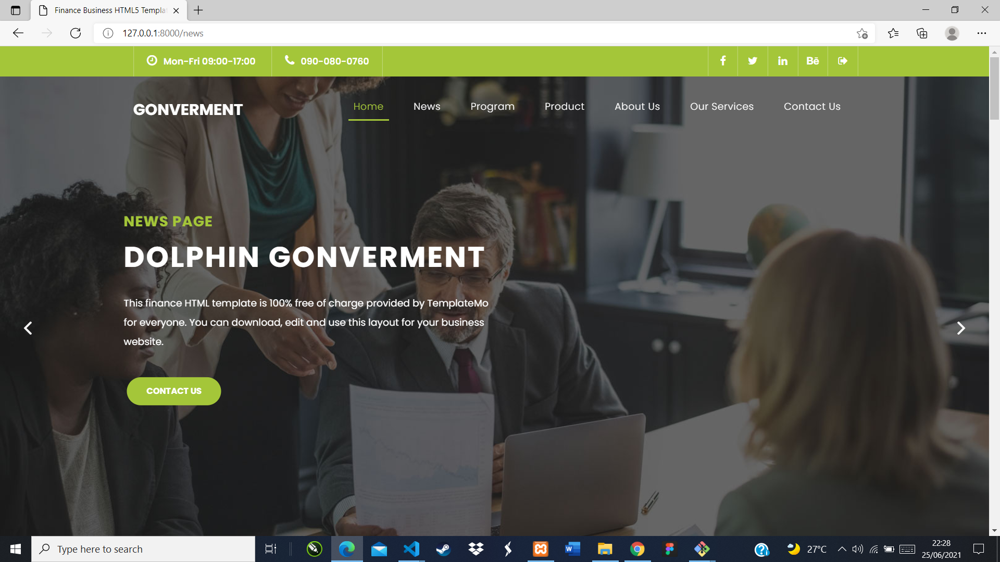

### Hasil Tampilan Halaman Program
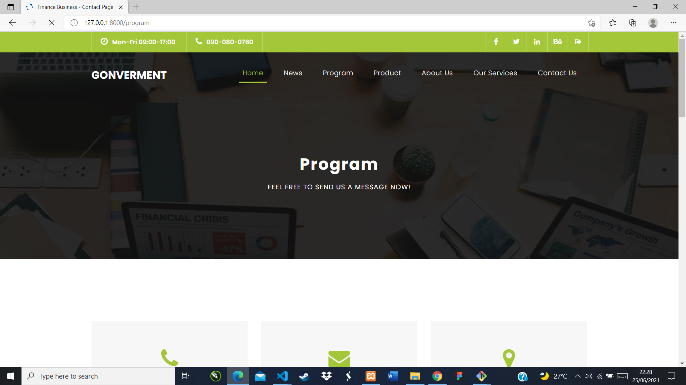

### Hasil Tampilan Halaman Product
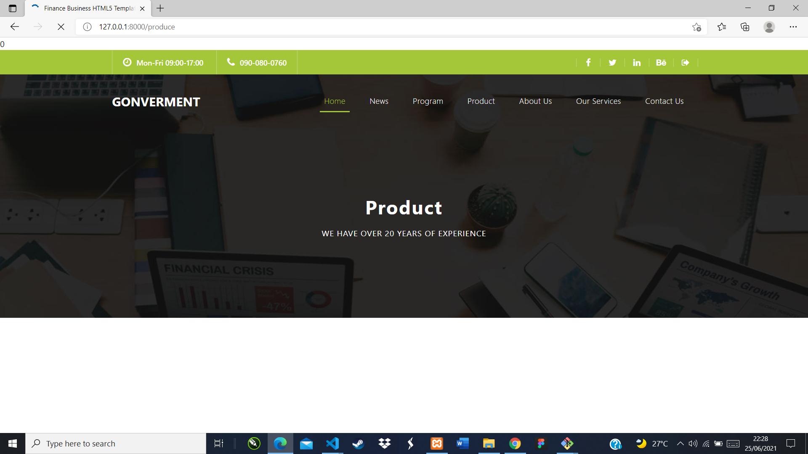

### Hasil Tampilan Halaman About
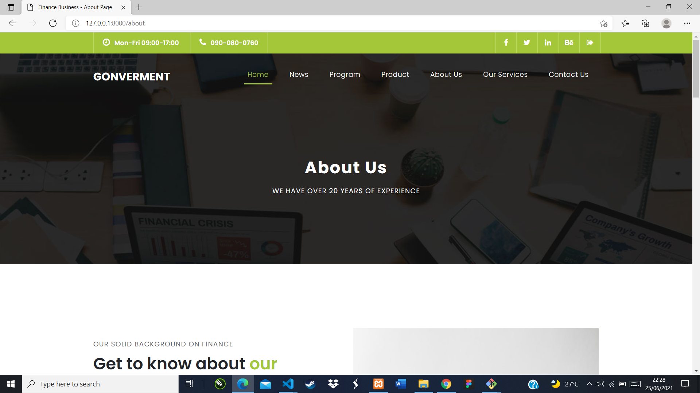

### Hasil Tampilan Halaman Service
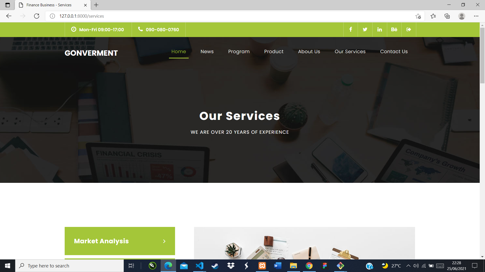

### Hasil Tampilan Halaman Contact

## Tampilan C.R.U.D di halaman Product 

### Hasil Tampilan Tambah Product
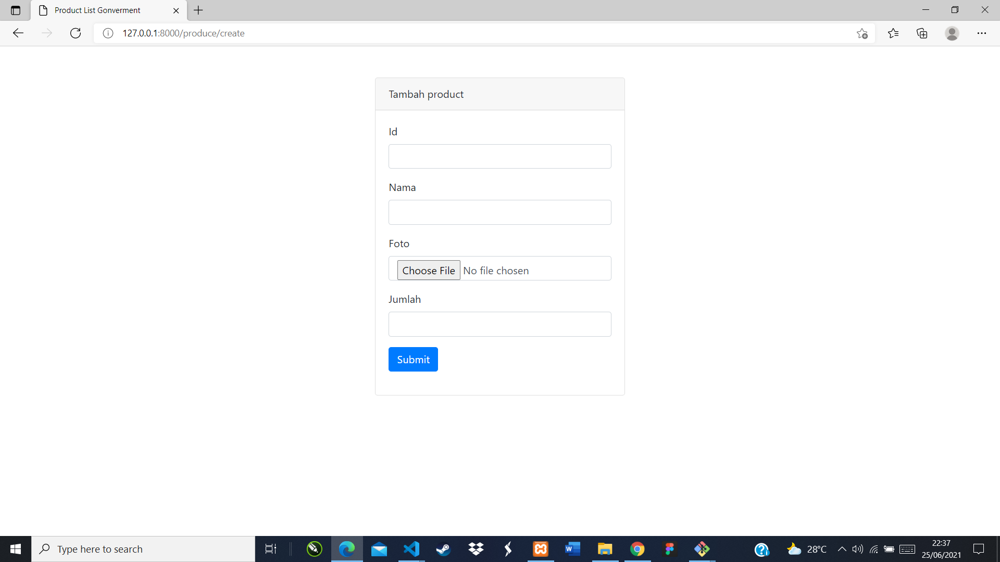

### Hasil Tampilan Edit
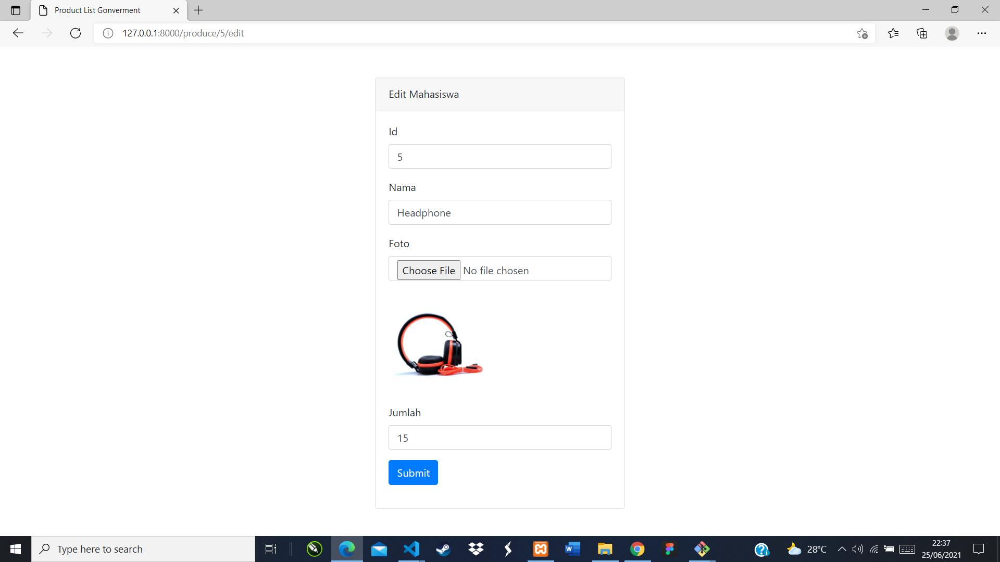

### Hasil Tampilan Show
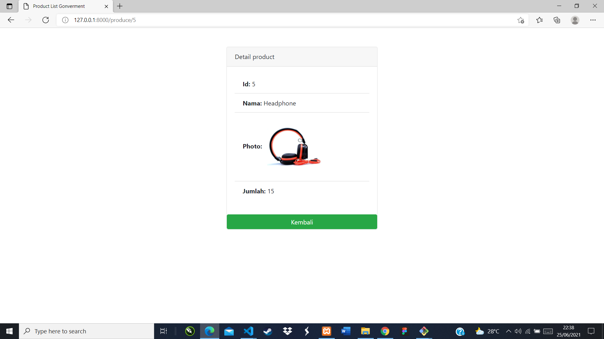

### Hasil Tampilan Delete
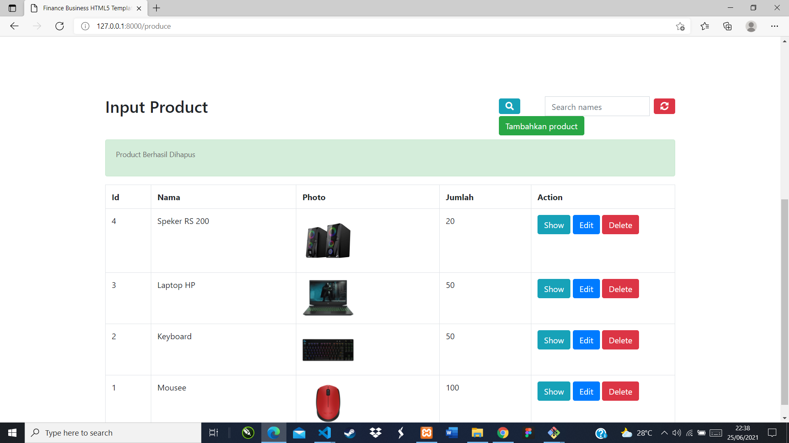

### Kode-kode Program

## Kode Program Model
[Kode Program Model](PWL_-UAS/app/Models)

## Kode Program View
[Kode Program View](PWL_-UAS/resources/views)

## Kode Program Controller
[Kode Program Controller](PWL_-UAS/app/Http/Controllers)

## Kode Program Router
[Kode Program Router](PWL_-UAS/routes)
